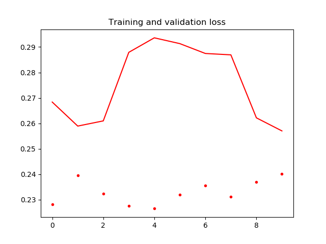
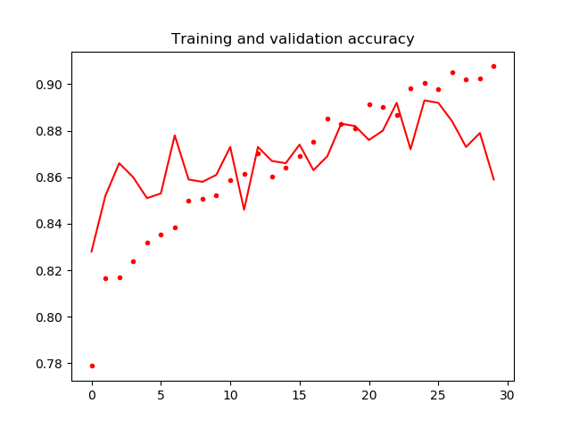

<h1 align="center">
  
   Gleam model 
  

    
    
    
  

</h1>

Skin cancer screening nerual network model

  

## About Gleam

Skin cancer is in third place in terms of the incidence of oncology detection in Russian men and second in women. The five-year threshold is experienced by only half of the patients. Even with the second stage of melanoma and with proper treatment. Therefore, an early production diagnosis is practically the only way to get a favorable prognosis for treatment. The solution could be a mobile application, with which you can make an early diagnosis and promptly seek treatment.

## Dataset

To train this model the data to use is a set of images from the International Skin Imaging Collaboration: [Mellanoma Project ISIC](https://isic-archive.com).

### Preprocessing

The following preprocessing tasks are developed for each image:

1. Visual inspection to detect images with low quality
1. Image resizing: Transform images to 255x256x3
1. Crop images

## Final result

#### AUC/ROC curve chart VGG16

###### For transfer learning model:

#### Training and validation loss VGG16

###### For transfer learning (30 epochs):

###### For fine tuning (10 epochs):

#### Training and validation accuracy VGG16

###### For transfer learning (30 epochs):

###### For fine tuning (10 epochs):

